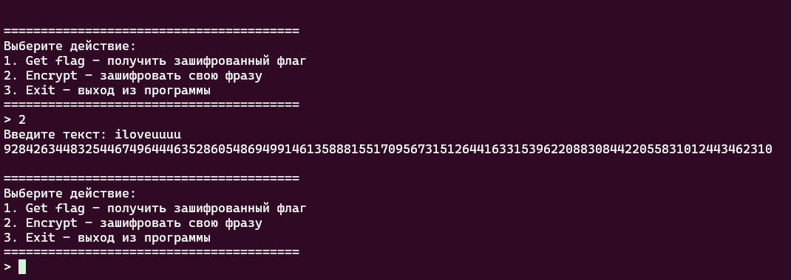

## Решение кастомной криптосистемы Полибия

| Событие | Название | Категория | Сложность |
| :------------- | ----------------------- | ------------------ | ------------------ |
| VKACTF 2025   | Atomibius Square     | crypto             | easy               |

### Описание

> Автор: l1l_w31rd03

После изучения компьютеров в Вавилове был обнаружен странный шифратор, который использовался для секретных документов.

### Решение

Подключаемся к сервису с помощью netcat:
nc hyu hyu.

Видим три возможных варианта действия:

    "1. Get flag - получить зашифрованный флаг"
    "2. Encrypt - зашифровать свою фразу"
    "3. Exit - выход из программы"

Выбираем 1, получаем шифрованный флаг формата:

222819352175225219862465207718401961206217892177216318682178226021542562237914881570202914791536227113091707195319171955235213481465187416901604

Посмотрим что будет, если зашифровать свой текст: 



Скачаем исходник и разберемся, что под капотом)
Видим усложненный шифр "Квадрат Полибия", нарисуем примерную схему того, что происходит с исходным текстом:

pt -> polibius -> pairs to matrix -> transpone matrix -> multiply matrix and invertible matrix -> ct

Как можно понять, основная сложность данной криптосистемы заключается в том, что результат исходного квадрата Полибия (представляющий собой пары координат каждой буквы по матрице кодирования) записывается в матрицу 6 на 6, дополняется нулями (если матрица не заполнена), далее эта матрица транспонируется и умножается на некоторую обратимую матрицу, полсе чего происходит разворачивание матрицы в формат ct.

Вспомнив курс линейной алгебры, поймем, что все действия являются обратимыми (умножение на матрицу контрится умножением на обратную, транспонирование также оборачиивается), попробуем описать основные действия на ЯП Python (в обратной последовательности выполняем те же шаги, что и в шифровании):

```python
def matrix_2_number(number_str: str, size: int) -> np.ndarray:
    numbers = []
    for i in range(0, len(number_str), 4):
        num = int(number_str[i:i+4])
        numbers.append(num)

    matrix = np.zeros((size, size), dtype=int)
    
    for i in range(size):
        for j in range(size):
            index = i * size + j
            if index < len(numbers):
                matrix[i][j] = numbers[index]
    return matrix
```

Перевели данный нам шифротекст в матрицу.
Далее надо найти матрицу обратную для данной и умножить на нее, также сразу транспонируем результат умножения:

```python
def decrypt_matrix(encrypted_matrix: np.ndarray) -> str:
    M = np.array([
        [9, 5, 2, 7, 1, 5],
        [8, 3, 4, 8, 8, 7],
        [9, 8, 9, 9, 5, 2],
        [2, 1, 7, 3, 8, 10],
        [10, 5, 4, 5, 7, 5],
        [2, 9, 9, 6, 5, 10]
    ])
    M_inv = np.linalg.inv(M)
    

    decrypted = np.dot(encrypted_matrix, M_inv).round().astype(int)
    

    decrypted = decrypted.T
    
    numbers = []
    for row in decrypted:
        for num in row:
            numbers.append(f"{num:02d}")
    
    return ''.join(numbers)
```

Ну и последний шаг - пройти по квадрату Полибя и собрать флаг:

```Python
def polibiusrator(encrypted_text: str) -> str:
    polybius_square = [
        ['A', 'B', 'C', 'D', 'E', 'F', 'G', 'H', 'I'],
        ['J', 'K', 'L', 'M', 'N', 'O', 'P', 'Q', 'R'],
        ['S', 'T', 'U', 'V', 'W', 'X', 'Y', 'Z', 'a'],
        ['b', 'c', 'd', 'e', 'f', 'g', 'h', 'i', 'j'],
        ['k', 'l', 'm', 'n', 'o', 'p', 'q', 'r', 's'],
        ['t', 'u', 'v', 'w', 'x', 'y', 'z', '0', '1'],
        ['2', '3', '4', '5', '6', '7', '8', '9', ' '],
        ['.', '!', '?', '_', '+', '-', '{', '}', '@'],
        ['#', '$', '%', '^', '&', '*', '(', ')', ';'],
        [':', '"', "'", ',', '<', '>', '=', '/', '\\'],
        ['|', '~', '`', '[', ']', '©', '®', '™', '§']
    ]

    decrypted_text = ""
    i = 0
    while i < len(encrypted_text):
        if i + 1 < len(encrypted_text):
            row = int(encrypted_text[i]) - 1
            col = int(encrypted_text[i+1]) - 1
            if 0 <= row < len(polybius_square) and 0 <= col < len(polybius_square[0]):
                decrypted_text += polybius_square[row][col]
            i += 2
        else:
            i += 1
    return decrypted_text
```

Полное решение написано на ЯП Python - [solver.py](./solver.py)

Флаг

```
vka{poli_atomic_square_cipher!!!}
```
