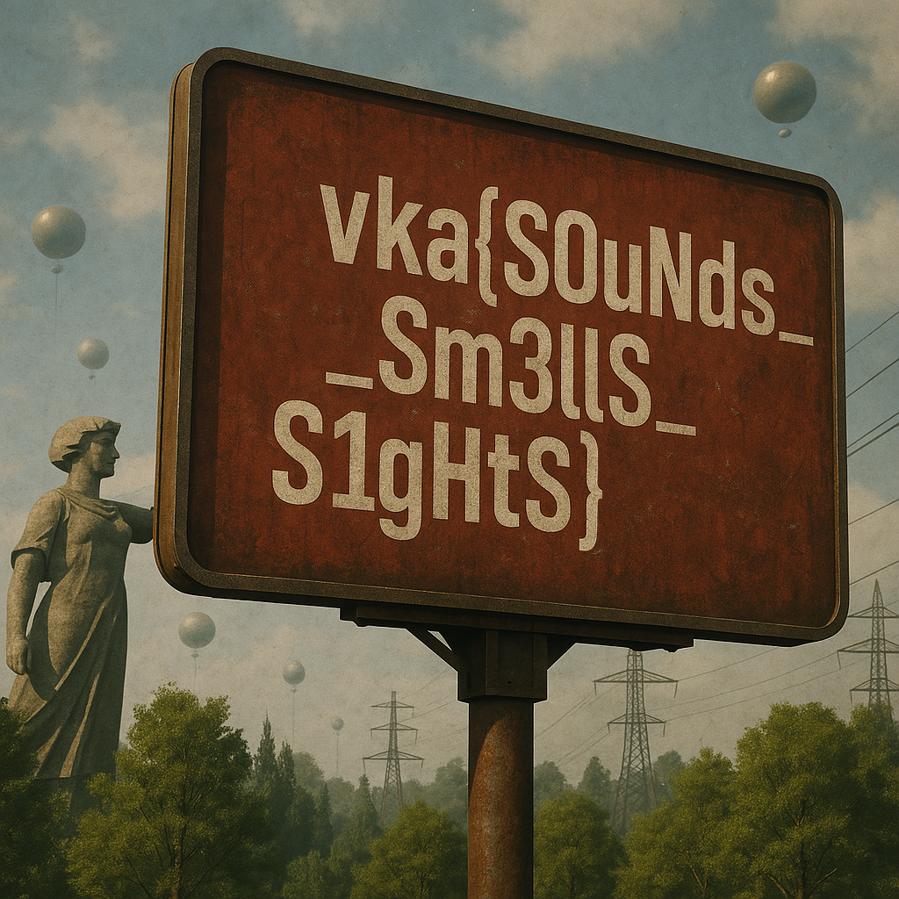

## RoB THE-RobOt

| Событие | Название | Категория | Сложность |
| :------ | ---- | ---- | ---- |
| VKACTF 2025 | RoB THE-RobOt | forensic | easy |

  
### Описание


> Автор: EGM
>
🎵 "Ты слышишь этот звук? Это не просто шум — это сигнал, писк атомарного сердца системы."


### Решение

Посмотрев и проанализировав логи, замечаем странный HTTP пакет. В нем идет GET запрос на сервер и загружается 1.mp3 фрагмент. Попробуем получить 2.mp3 УСПЕХ! 3... 4... 5... и тд. Пока аудиозаписи перестанут загружаться. 

Экспереметируем с декодерами звука и распознав, что это SSTV, склеиваем все полученные аудио в 1 дорожку и декодируем. Но безуспешно: картинка кривая.

Пишем скрипт, который склеит 10 файлов разными способами в 1 дорожку, и декодируем их. Одна из дорожек привела к успеху. А на ней и билборд с флагом!


### Флаг

```
vka{S0uNds_Sm3llS_S1gHtS}
```
