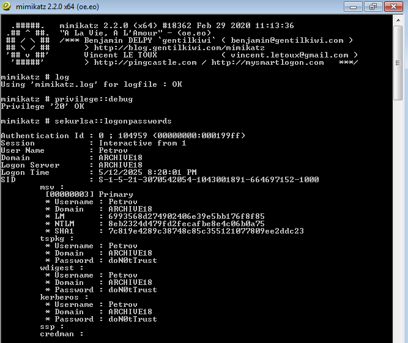
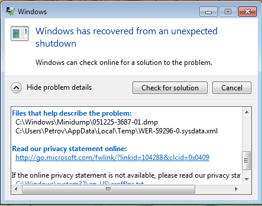
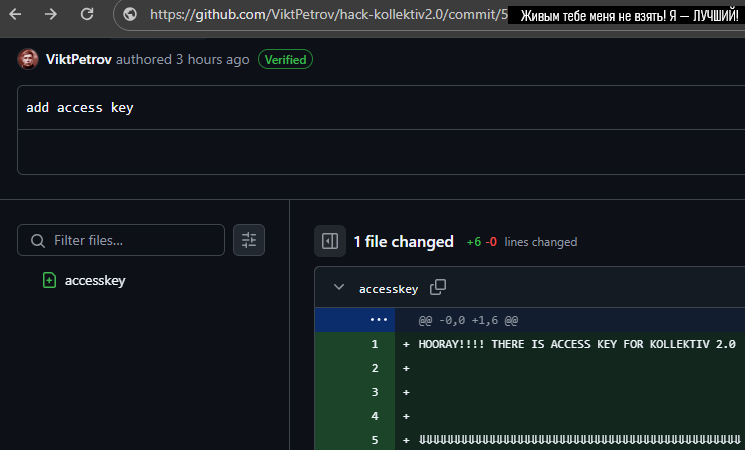

## Нашёл и посмотрел

| Событие | Название | Категория | Сложность |
| :------ | ---- | ---- | ---- |
| VKACTF 2025 | Архив полигона 18 | forensic | hard |

  
### Описание


> Автор: one!tea
>
Ох уж этот Петров... Сколько гоняюсь, а без толку. Теперь ещё и эта виртуальная машина... Хотя, в ней осталось то, что сумасшедший товарищ хотел бы скрыть.


### Решение
После скачивания файла, получаем виртуальную машину для Oracle VirtualBox, заходим на неё и видим два снимка: `backup`(выполнен вход), `bluescreen`(вход не выполнен, машина была завершена с синим экраном)

Читаем, что имеем: `MEMO.txt` и `PLAN.txt`. Отсюда мы должны уловить несколько вещей:
1) При ошибках, где-то есть дамп памяти, и он может быть удалён в связи с какими-то нашими действиями;
2) После загрузки файлов Петров хотел сделать какие-то `опасные вещи`, которые, возможно, могли вызвать синий экран.

Получим пароль пользователя Petrov.

Поскольку в первом снимке выполнен вход, то мы можем воспользоваться mimikatz в снимке "backup" и получить пароль от Windows7, а именно `doN0tTrust`



Входим в снимке `bluescreen` и видим окно восстановления после неправильного завершения (его закрывать НЕЛЬЗЯ!)



Далее начинаем изучать систему. Узнаём, что дамп памяти сохраняется стандартно при ошибках в `MEMORY.DMP`, находящийся в `C:\Windows\`

Забираем этот файл к себе на машину.

Теперь для удобства работы с утилитами и прочим удалим все снимки в VirtualBox, тем самым объединив их в один `ARCHIVE18.vmdk`.

Далее есть два варианта действий:

#### через `Elcomsoft Forensic Disk Decryptor`(Очень полезная, но очень дорогая. ^-^)

Выкачиваем ключи из MEMORY.DMP. Далее через FTK Imager подключаем `ARCHIVE18.vmdk` к себе зашифрованный раздел и либо достаём ключ восстановления, либо расшифровываем его сразу и монтируем.

Достали `image.exe`

#### через `aeskeyfind`, `bdemount` (ХВАТАЕМ БЕСПЛАТНО!)

Прогоняем `MEMORY.DMP` через `aeskeyfind` и, вуаля, ключики:

```
4d84c6ab287b7fb7684c16aaeb5f5d54
1c0681d8537006d094759b88f85e666b
7ebeb435e11f91ef1ac088808fb21920
```

Теперь нам необходимо сделать `ARCHIVE18.vmdk` "сырым", чтобы он воспринимался утилитами корректно. В связи с динамическим заполнением виртуальной машиной своего .vmdk файла.

Вот команды >>

```
qemu-img convert -f vmdk -O raw "ARCHIVE18.vmdk" "ARCHIVE18.raw"
fdisk -lu "ARCHIVE18.raw"
dd if="ARCHIVE18.raw" of="topsecret.dd" bs=512 skip=23066624 count=2095104
```

Осталось расшифровать topsecret.dd и монтировать его в систему.
Делаем >>

```
mkdir /media/createddir1
bdemount -k 1c0681d8537006d094759b88f85e666b:7ebeb435e11f91ef1ac088808fb21920 topsecret.dd /media/createddir1
```

Достаём bde1 и подключаем его через mount. Заходим в раздел и видим единственный файл: image.exe

Исполняем его и видим изображение



Всё ведёт к определённому коммиту в репозитории `https://github.com/ViktPetrov/hack-kollektiv2.0/`, но там нет коммита, который нам нужен.

Чуток погуглив про скрытые и удалённые репозитории на GitHub, можно найти следующую [статью](https://habr.com/ru/companies/ruvds/articles/835448/)

Теперь осталось пробрутить все возможные короткие sha1, длинной от 4 символов (из списка `0,1,2,3,4,5,6,7,8,9,a,b,c,d,e,f`). Но благо мы видим, что sha1 начинается с `5`

Создаём [сплойт](brute_git.py) с сессией своего аккаунта GitHub или пользуемся BurpSuite Intruder. Получаем 200-ый ответ на правильной комбинации и соответственно флажок!

### Флаг

```
vka{P3tr0v_c4nn0t_be_t4ken_aliv3}
```
