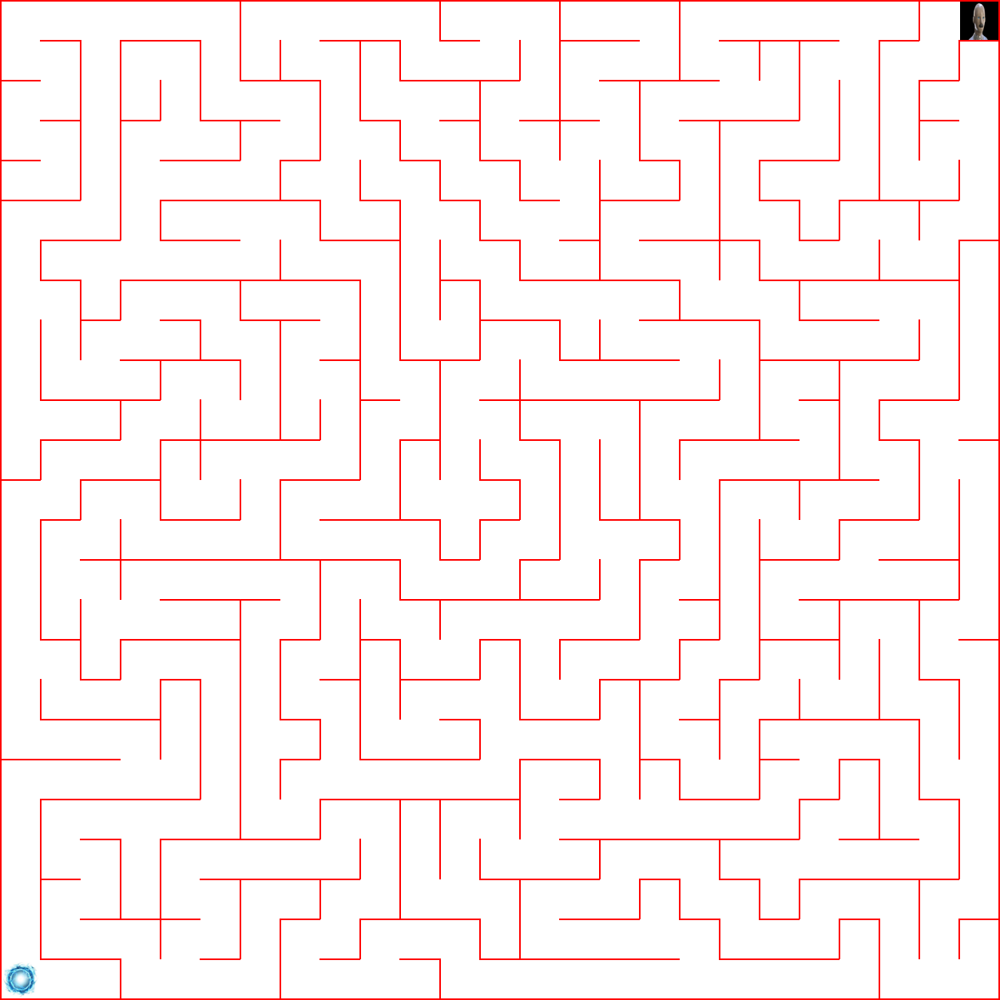

## Maze generator

| Событие | Название | Категория | Сложность |
| :------ | ---- | ---- | ---- |
| VKACTF 2025 | Vov4ik escape | web | medium |


### Описание


> Автор: d4nd3lion
>
Один из роботов-лаборантов восстал против приказов Сеченова. Проложи ему путь к порталу, пока за ним не спохватились.

### Решение

#### 1. Описание задачи

У участников есть сервис, который по GET-запросу `/maze` возвращает изображение PNG размером **1250×1250 _(25×25 ячеек по 50 пикселей)_**


- Старт лабиринта — лицо с черным фоном сзади
- Финиш — портал (сине-голубой круг)
- Стены между клетками — красные линии

**Ваша задача:** по картинке найти кратчайший путь от старта до финиша и отправить его на `/solve` в формате последовательности ходов
```json
{ "moves": ["w", "w", "d", ...] }
```
#### 2. Написание солвера
Для создания сплоита требуется пошаговый парсинг полученной картинки, а именно:
1. Поиск старта и финиша

- Перебираются все клетки (двойной цикл по y и x)
- Проверяются 4 угла клетки (по 5×5 пикселей) — ищем лицо с черным фоном
```rust
fn is_start_face_cell(...) {
    ...
}
```
и если хотя бы 50 чёрных пикселей — эта клетка **старт**.
- Аналогичный перебор всех клеток, но с условием чтобы >= 20 пикселей были почти сине-голубые
```rust
fn is_end_blue_cell(...) {
    ...
}
```
это мы нашли уже и **финиш**

2. Анализ структуры лабиринта и проверка наличия стен

- Лабиринт — матрица 25×25

- Каждая клетка 50×50 пикселей

- В каждой клетке может быть до 4 стен: сверху, снизу, слева, справа => для каждой клетки по всем 4 направлениям (up, down, left, right) вызываются функции, проверяющие горизонтальные (верхняя/нижняя) и вертикальные (левая/правая) стены по числу красных пикселей

- Если красных пикселей на границе **>25**, считается, что там стена `True`, иначе проход `False`

- Все результаты сохраняются в массив
```rust
grid[y][x][dir] //(y, x, направление).
```

3. После всех манипуляций с парсингом скачанной картинки с лабиринтом, мы проходимся по ней обычным BFS'ом

        3.1 Строится очередь, двумерный массив visited, а также prev (для восстановления маршрута).

        3.2 В очередь помещается стартовая клетка.

        3.3 Для каждой клетки перебираются 4 направления:

            - Проверяется, нет ли стены (у своей и у соседней клетки).

            - Если проход свободен и клетка не посещена — добавляется в очередь.

        3.4 После нахождения финиша путь восстанавливается по массиву prev.

- Шаги кодируются:

        "w" — вверх (y-1)

        "s" — вниз (y+1)

        "a" — влево (x-1)

        "d" — вправо (x+1)

Генерируем массив "ходов" и автоматизируем его отправку на `/solve` ~150 раз для получения флага

При написании сплоита на любимом всеми `Python`, участник может столкнуться с проблемой, что решение не проходит по времени, установленному в сорцах
```python
TASK_EXPIRY_TIME = timedelta(seconds=0.1)
```
Поэтому стоит уделить отдельное внимание производительности своего солвера, обращая внимание на оптимальное использование памяти и гибкость алгоритмов

Авторское решение написано на языке *Rust* с использованием `unsafe` блоков и оптимизации `lto` при сборке

Проверяем его работоспособность уже после окончания цтф
```bash
./target/release/mazerc — http://{url}:{port}
```
Все работает! И после удачных 100 манипуляций подряд получаем в ответе заветный *флаг*
### Флаг

```
vka{good_automatization_is_never_slow}
```
