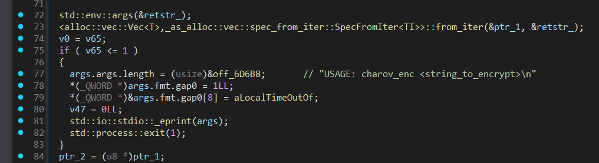
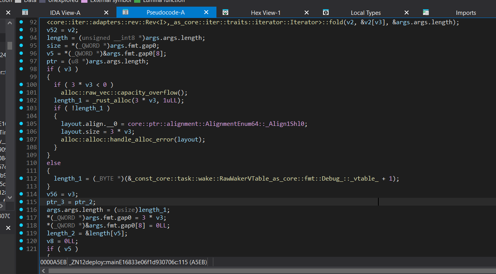
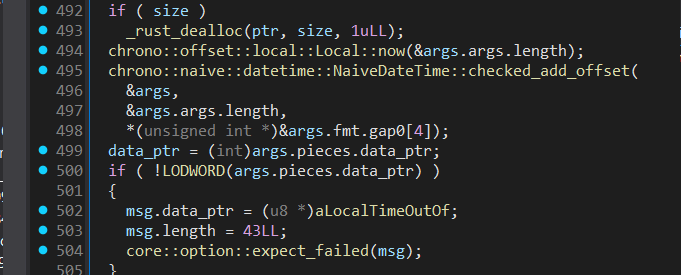
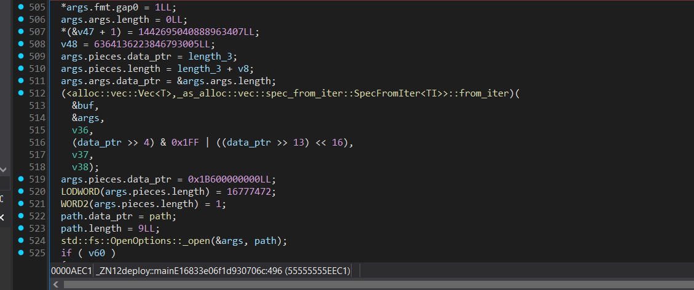

## Решение обратимого XOR и реверс ЯП Rust

| Событие | Название | Категория | Сложность |
| :------------- | ----------------------- | ------------------ | ------------------ |
| VKACTF 2025   | Генератор Чарова     | crypto/reverse             | medium               |

### Описание

> Автор: l1l_w31rd03, Invis_one

В секретной лаборатории, расположенной под ВДНХ обнаружен загадочный квантовый дешифратор, созданный доктором Чаровым. Устройство использует "невозможный" алгоритм шифрования, основанный на советских квантовых технологиях 1985 года.  


### Решение

Так как для написания программы использовался ЯП `rust`, то воспользуемся [IDARustDemangler](https://github.com/timetravelthree/IDARustDemangler), чтобы упростить анализ. Видим, что программа принимает на вход один аргумент, иначе выводит ошибку.



Затем идет обработка введенной строки, а именно изменяется по следующему алгоритму:
1) Полученная строка заворачивается и припысывается в начало
2) После каждого символа развернутой части вставляется символ неразвенутой строки, а затем наоборот

Например: `vka -> akvvka -> avkkvavakkav`

То есть, для того, чтобы получить исходную строку, достаточно прочитать каждый четный символ до середины длины.



После берётся текущее время системы, а именно день и год, преобразуется в `u64`, которое затем передается аргументом функции шифрования



Проанализировав декомпиляцию, можем увидеть, что в коде реализован следующий функционал: ГПСЧ типа LCG и XOR в функции encrypt.



Разберемся в ГПСЧ: 

PS: исходный код ГПСЧ был взят из библиотеки [lcg-rand](https://crates.io/crates/lcg-rand)

```Rust
        pub fn next(&mut self) -> u64 {
            //! Generate the next value and return it.
            self.value = (
                ((self.multiplier as u128) * (self.value as u128) + self.increment as u128) % self.modulus
            ) as u64;

            self.value
```
По методу генерации чисел можем понять, что это обычный линейный конргуэнтный генератор, работающий по формуле: 

$`X_{n+1}=(aX_{n}+c) \bmod m`$

Притом из кода также видно, что параметры m, a, c также известны:

```Rust
    const MODULUS: u128 = 2u128.pow(64);
    const INCREMENT: u64 = 1442695040888963407;
    const MULTIPLIER: u64 = 6364136223846793005;
```

Восстановим работу генератора на ЯП Python:

```python
    MODULUS = 2**64
    INCREMENT = 1442695040888963407
    MULTIPLIER = 6364136223846793005

    class LCG:
        def __init__(self, seed):
            self.state = seed

        def next(self):
            self.state = (self.state * MULTIPLIER + INCREMENT) % MODULUS
            return self.state

    lcg = LCG(seed)
```

Видим, что остается две проблемы: XOR функция и seed. Вспоминаем, что XOR - обратимая операция и для обратного XOR'а необходимо знать keystream, который основан на получении значений от ГПСЧ. Для полного восстановления работы генератора нам необходимо получить значение seed, при котором генератор будет давать ту же последовательность, которая использовалась при выполнении fn encrypt. Для этого вспомним, что бинарь брал системное время и затем передавал как аргумент функции. Вот аналог этой записи из исходного кода: 

```Rust
let date_as_u64: u64 = ((year as u64) << 16) | (day_of_year as u64);
```

То есть поиск/брут seed - тривиальная задача, заключающаяся в поиске корректного года и дня, напишем функцию для брута значения переменной seed на ЯП Python:
(не забываем учитывать, что генератор не может принимать системное время до 1 января 1970 года, следовательно это и будет отправной точкой для нашего брута)

```python
def brute_seed(start_year, start_day):
    end_year = 2025

    for year in range(start_year, end_year + 1):
        max_day = (
            366
            if (year % 4 == 0 and year % 100 != 0) or (year % 400 == 0)
            else 365
        )

        for day in range(start_day, max_day + 1):
            seed = (year << 16) | day
            yield seed, year, day
```

Пробрутив seed и проверив его на корректность путём применения генерируемого keystream'a к шифротексту, получаем флаг

Пример решения: [solution.py](./solution.py)

Флаг

```
vka{charovs_alg_isnt_strong_enough}
```
