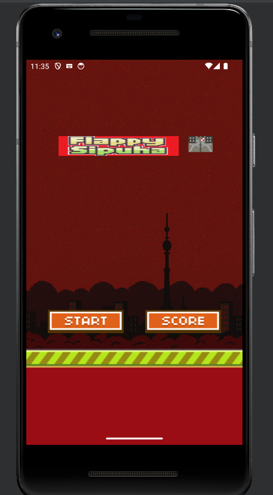

## APK Flappy Bird game

| Событие | Название | Категория | Сложность |
| :------ | ---- | ---- | ---- |
| VKACTF 2025 | Flappy Sipuha | reverse | easy |

  
### Описание


> Автор: Invis_one
>
Рабочие на Челомее тоже хотят отдыхать. Попробуйте и Вы победить в их игре.


### Решение

Участникам выдается `apk`. Это переделанная игра `Flappy Bird`, позаимствованная из репозитория [VadimBoev](https://github.com/VadimBoev/FlappyBird)



Попробуем поиграть, после поражения появляется кнопка `FLAG`. На первый взгляд, при нажатии ничего не происходит, однако в логи выводится следующее сообщение:


Становится ясно, что для получения флага необходимо набрать 100.000 очков. Разберёмся в логике работы приложения. Для этого, проанализируем приложение в `JEB`


Заметим, что приложение использует динамическую библиотеку, а также, что оно не написано на `Java`, `Kotlin` или других ЯП, в основном использующихся для разработки мобильных приложений. Значит, весь функционал определён в динамической библиотеке. Перейдём к её анализу. Загрузим библиотеку в `IDA` и посмотрим на строки.


### Способ №1

В данном способе мы проанализируем логику работы игры и дешифруем флаг.

Видим строчку `FLAG:`. Просмотрев её вызовы, находим логику работы кнопки `FLAG`. У неё следующий функционал:
1) Если лучший счёт игрока меньше 100000, то в логи выводится сообщение об ошибке, иначе работа продолжается.
2) Происходит TCP-соединение с сервером и получение base64-закодированного флага.
3) Декодирование base64.
4) Дешифрование флага. Флаг зашифрован с помощью `XOR`, начиная с `0x42`, сдвигая следующий ключ на `0x11`.
5) В случае, если всё прошло без ошибок, то в логи выводится дешифрованный флаг.

Ниже приведён скриншот с декомпиляцией вышеописанной логики работы.


Мы можем самостоятельно подключиться к серверу, получить зашифрованный флаг и декодировать его. Пример решения представлен в [solution.py](solution.py)

### Способ №2

Кроме строчки флаг, мы также могли заметить строчку `%s/save.txt`, что означает, что игра сохраняет данные для того, чтобы после ее перезапуска она могла загрузить сохраненные данные.


Стандартное место для сохранения данных, необходимых для функционирования приложения в Android, - это `/data/data/com.appname.dev`.  Перейдём туда и посмотрим, что в нём хранится.

Как оказывается, в нём хранится одно число, а именно лучший результат, который как раз проверяется при получении флага, поменяем, например, на 100000.


Затем нажимаем на кнопку `FLAG`, проверяем логи, видим флаг


### Флаг

```
vka{behold_its_flappy_bird_master}
```
