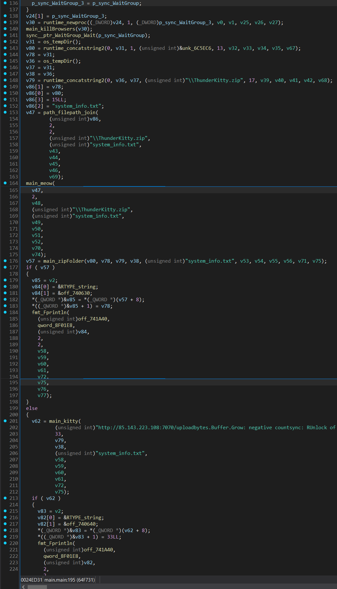
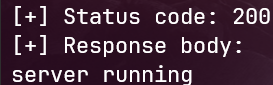
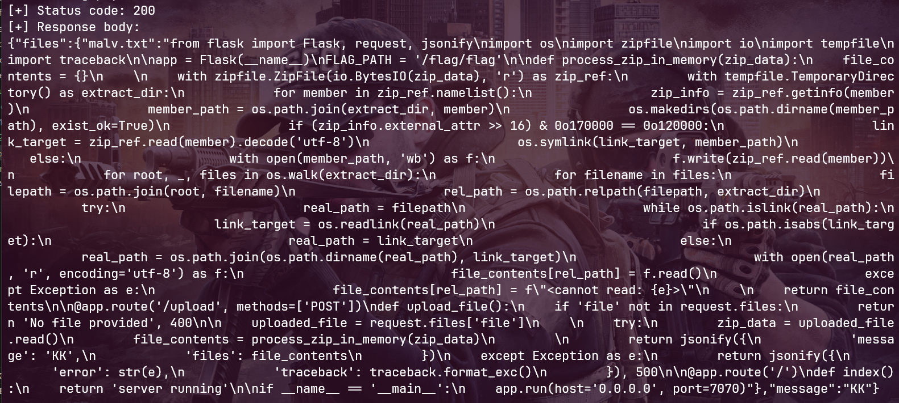

## Go stealer

| Событие | Название | Категория | Сложность |
| :------ | ---- | ---- | ---- |
| VKACTF 2025 | AtomicDesk | reverse | hard |

  
### Описание


> Автор: Invis_one
>
На все служебные компьютеры комплекса ВДНХ устанавливают программу для контроля производительности рабочих. Это не может быть поводом следить за нами, ведь так?


### Решение

Участникам выдается `PE`. Это обезвреженный стиллер на языке `GO` `ThunderKitty`, позаимствованный из репозитория [EvilBytecode](https://github.com/EvilBytecode/ThunderKitty)

После запуска файла, закрываются браузеры, выводиться ложная ошибка. Более на первый взгляд ничего не происходит, однако, собирается информация о системе пользователя, пакуется в `zip` архив и отправляется на хост. Файлы сохраняются в `%temp%`
Такую же логику можно проследить при анализе исполняемого файла.



Из имеющийхся данных, можем сделать вывод, что необходимо найти уязвимость на хосте. На нем реализована только одна функция: прием архива, разархивирование, чтение содержимого архива. Из этого можно сделать лишь один вывод - это возможная `zipslip` уязвимость на хосте. С учетом того, что читается содержимое разархивированных файлов, нас интерисует `zipslip` через символические ссылки.

Если мы попробуем сходить на ручку `/`, то получим следующий ответ:



Это нас наталкивает на мысль, что сервер скорее всего написан на `flask`. Стандартное расположение файла сервера `/app/server.py`. Если попробовать с помощью `zipslip` прочитать его, то получим следующие:



Бинго! Видим переменную `FLAG_PATH` и соответсвенно путь, где располагается сам флаг.

Остается лишь правильно собрать архив с `zipslip` до пути флажка. Пример решения представлен в [solution.py](solution.py)


### Флаг

```
vka{sliping_through_some_nasty_stealer}
```