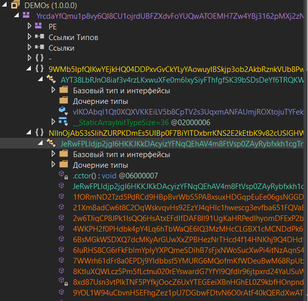
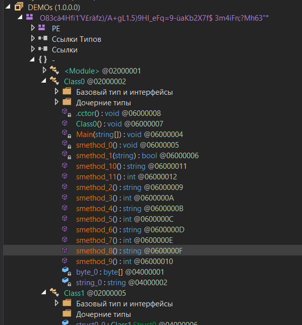
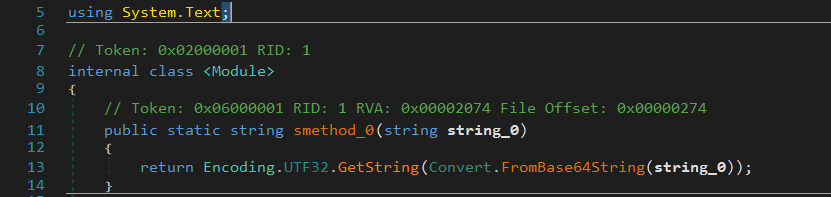
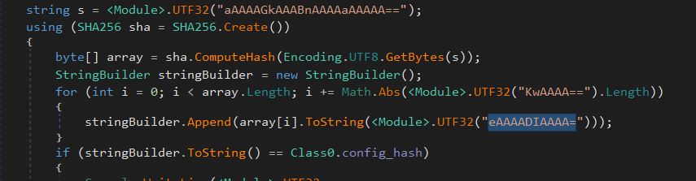
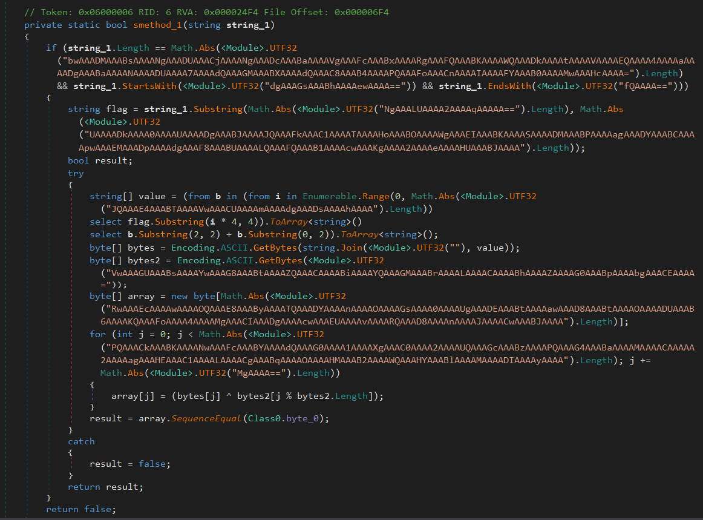
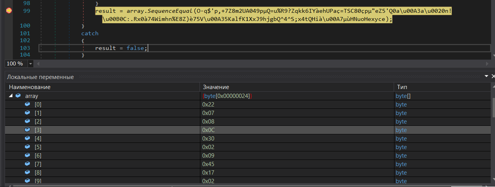

## Двойная обфускация C# .NET

| Событие | Название | Категория | Сложность |
| :------ | ---- | ---- | ---- |
| VKACTF 2025 | Double action | reverse | medium |

  
### Описание


> Автор: Invis_one
>
Ура, вышла новая версия DEMOS. Блин, разрабы не дают нормально разобраться в ее Логике работы...


### Решение

Участникам выдается `PE C# .NET`. Для защиты, применялось две обфускации (одна самописная и [LoGiC.NET](https://github.com/AnErrupTion/LoGiC.NET) версии 1.2)

### Сложный способ



Используем `.NET Slayer`, получаем адекватные названия и вызова методов



Обращаем внимание на метод `smethod_0`, он декодирует из base64 и UTF-32



Немного разбираемся в логике работы программы. При запуске береться SHA-256 от строчки `s`, затем выводиться меню программы. Этот участок нас не интересует



Нас интересует только первая опция, разираемся в логике её работы:
1) В полученной строке проверяется длина, должна быть 41
2) Отрезаются `vka{` и `}`, разбивается на блоки по 4 символа, в блоках меняются местами 1 и 2 с 3 и 4
3) XOR с `Welcome back, admin!`
4) Сверяется с эталонным массивом



Обращаем действия с эталонным массивом. Эталонный массив получаем с помощью breakpoint во время сравнения массивов. Пример решения представлен в [solution.py](solution.py)



### Легкий способ

Берем деобфускатор, например, [LoGeek](https://github.com/miso-xyz/LoGeek). После его применения проделать все действия, описанные выше, становиться сделать в разы легче. Повторяем, получаем флаг

### Флаг

```
vka{double_obfucation_didnt_really_works}
```
