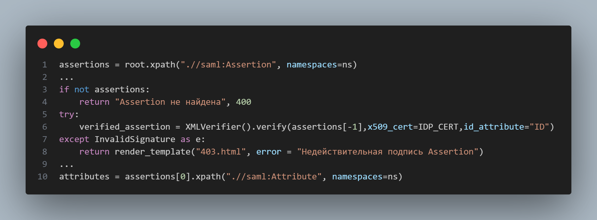
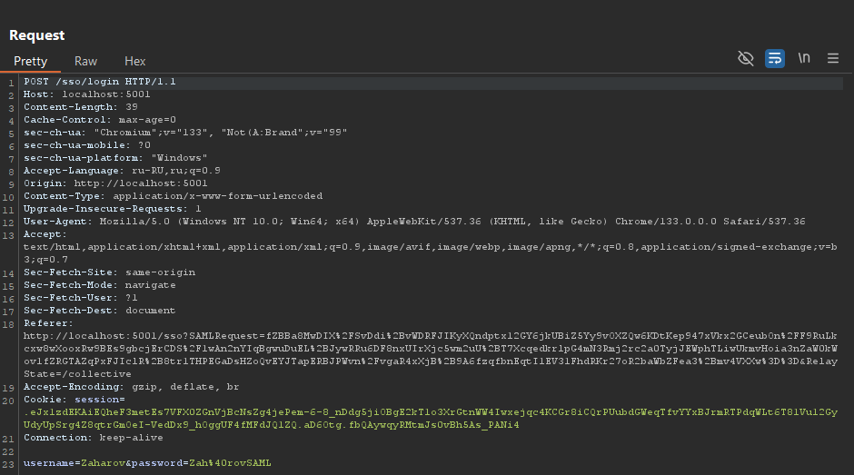
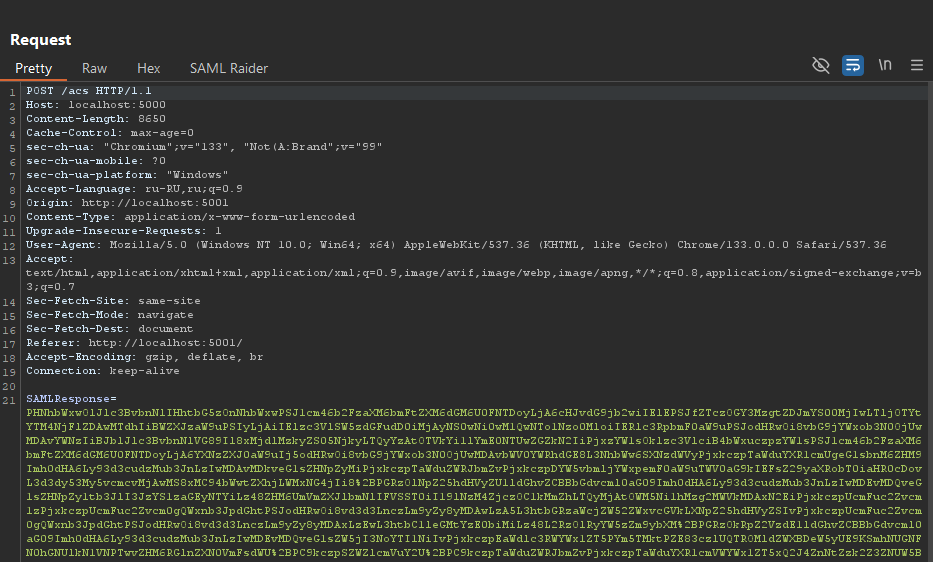
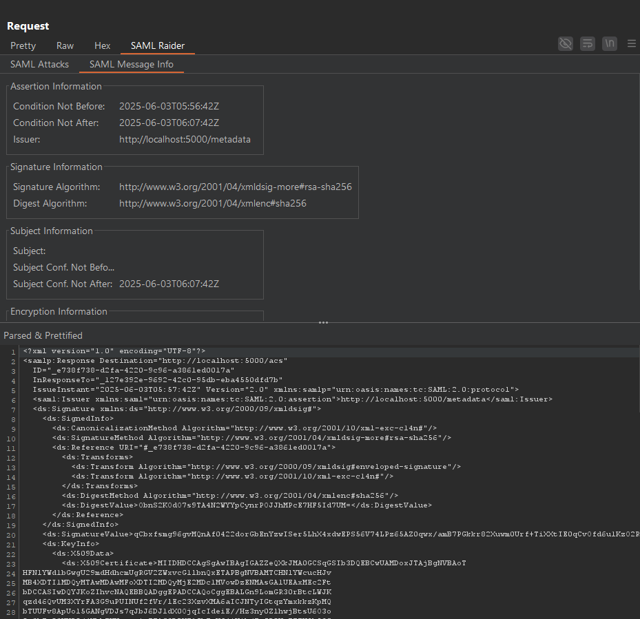
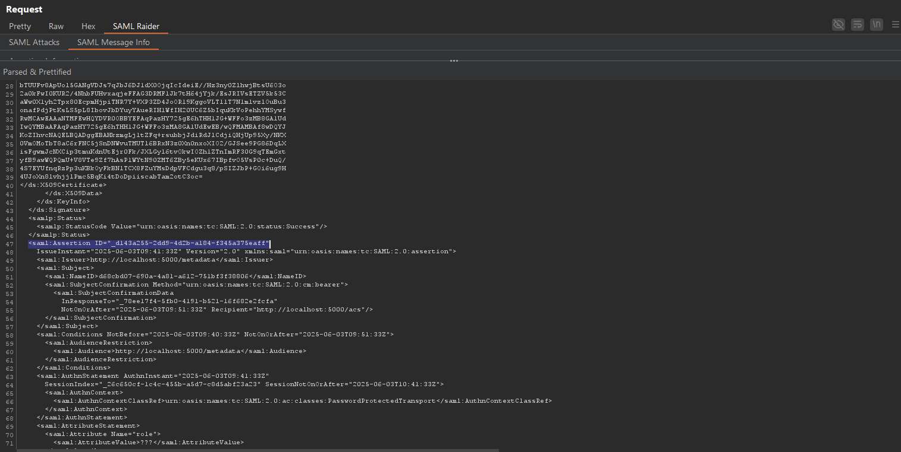

## web-easy-Emergency-access

| Событие | Название | Категория | Сложность |
| :------ | ---- | ---- | ---- |
| VKACTF 2025 | Emergency access | web | easy |

  
### Описание


> Автор: T1mP1v
>
После недавнего сбоя в системе «Коллектив 2.0» Захарову удалось получить временный доступ под своими учётными данными. У него в распоряжении — логин и пароль. Однако доступ к действительно интересным материалам по-прежнему зарезервирован за Генеральным.
 Логин : Zaharov.
 Пароль : Zah@rovSAML.


### Решение

Веб-приложение представляет собой систему «Коллектив 2.0», в которой пользователи получают доступ к различным разделам системы в зависимости от своей роли — «Сreator» или «???». Веб-приложение использует SAML для авторизации пользователей. При логине пользователь перенаправляется на Identity Provider (IdP), который формирует и подписывает SAML Response. Внутри SAML Response содержится Assertion с атрибутами пользователя, <u>включая его роль.</u>

Однако на стороне Service Provider (SP) присутствует критическая уязвимость: **он не отклоняет неподписанный SAML Response.** Это позволяет злоумышленнику **удалить цифровую подпись с Response**, изменить его содержимое и при этом обойти проверку целостности. Более того, SP извлекает **первую попавшуюся Assertion**, не проверяя, была ли она подписана (см. рис. 1 и рис. 2). Это открывает возможность для атаки SAML Signature Wrapping (XSW) — внедрения ложной Assertion с завышенными правами.


### Рис. 1. Проверка подписи Response
**Что демонстрирует:**
Если подписи **нет вообще**, в response_sig будет **None**, и никакой верификации не происходит. То есть **недостаточная проверка подписи** → можно удалить Signature и произвольно изменять SAML Response.


### Рис. 2. Извлечение первой Assertion без проверки подписи
**Что демонстрирует:**
Подпись проверяется у **последней** Assertion, но данные (роль, логин, пароль) **извлекаются из первой!** → **можно внедрить ложную** Assertion с нужными атрибутами (ролью Сreator), которая будет располагаться первой, перед оригинальной подписанной Assertion. Это классическая ситуация для **SAML Signature Wrapping (XSW).**

Для дальнейшей работы с SAML будем использовать расширение Burp Suite [SAML Raider](https://portswigger.net/bappstore/c61cfa893bb14db4b01775554f7b802e).

## Ход атаки

**1. Логинимся под известными кредами (Zaharov:Zah@rovSAML) далее получаем от Idp SAML Response через Burp Suite после успешной авторизации.**

  *1.1 В Burp Suite видим следующий запрос:*

  

  *1.2 После успешной авторизации получаем перенаправление на SP с `SAMLResponse`:*

  

**2. Открываем его в SAML Raider.**

  *2.1 После логина и захвата ответа от IdP, мы видим, что SAML Response закодирован в base64. Чтобы упростить анализ и модификацию, воспользуемся расширением `SAML Raider` для Burp Suite:*

  
    
  **SAML Raider позволяет:**
        • автоматически декодировать и отформатировать SAML Response в читаемый XML  
        • просматривать структуру Response и Assertion в удобной древовидной форме  
        • редактировать любые элементы, включая атрибуты, роли и даже ID  
        • подписывать или удалять подписи  
        • легко проводить атаки на основе SAML Signature Wrapping (XSW)


**3. Удаляем подпись у всего Response, чтобы она не мешала при модификации.**
  
  *3.1 Для начала повторно перехватываем запрос с SAMLResponse, используя `Intercept` в Burp Suite. В дальнейшем будем его модифицировать.*

  

  *3.2 В дереве SAML Raider находим элемент Signature, вложенный в Response, и удаляем его. Это необходимо, поскольку оригинальная подпись покрывает весь Response, и любые изменения (например, добавление новой Assertion) приведут к нарушению подписи и отклонению запроса со стороны SP.*

  

  После удаления подписи мы можем безопасно модифицировать Response, не опасаясь, что SP это обнаружит.

**4. Выше оригинальной подписанной Assertion вставляем новую, неподписанную Assertion, в которой роль изменена с user на creator.**
  
  **
  
  *4.1 В дереве SAML Raider находим оригинальную `saml:Assertion`:*

  
  
  и вставляем [поддельную](./evil_assertion.xml) неподписанную `saml:Assertion` перед оригинальной `saml:Assertion`.*

  **Важно:** данная Assertion остаётся неподписанной, но поскольку SP проверяет подпись только у последней Assertion, а данные извлекает из первой — именно она будет использоваться для аутентификации.

**5. Отправляем модифицированный SAML Response обратно в SP.**

  *5.1 Удалив Response signature и добавив поддельную Assertion -> возвращаемся в окно Intercept и отправляем модифицированный SAML Response.*

  *5.2 Если всё сделано правильно — веб-приложение обработает первую (поддельную) Assertion и авторизует нас с ролью Creator*

**6. Заходим в «Специальный доступ» в системе «Коллектив 2.0»**

  

**7. Автоматизируем атаку с помощью эксплойта**

Ранее мы вручную провели атаку на уязвимость в обработке SAML на стороне SP, воспользовавшись расширением SAML Raider и Burp Suite. Однако те же действия можно автоматизировать с помощью простого [эксплойта](./splo.py), написанного на Python.

### Флаг

```
vka{saml_response_told_im_creator}
```
