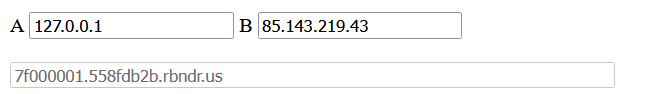
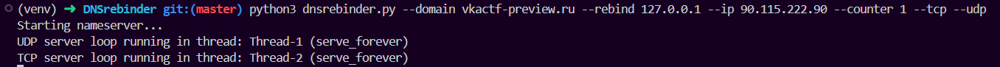
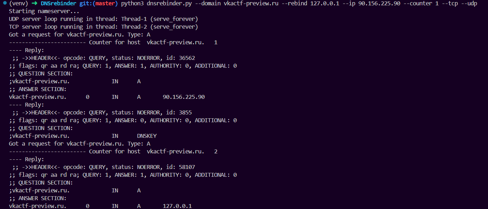
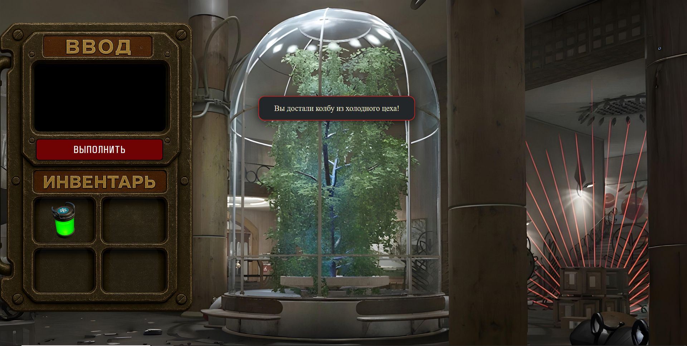

## Advanced SSRF exploitation

| Событие | Название | Категория | Сложность |
| :------ | ---- | ---- | ---- |
| VKACTF 2025 | ПК-4 "Берёза" | web | medium |


### Описание


> Автор: d4nd3lion
>
Впоследствии аварии мы потеряли доступ к научно-производственным цехам, тебе необходимо запитать наш полимерно-вегетативный генератор энергии, достав специализированные полимеры из каждого комплекса. Можешь воспользоваться панелью управления распределительного центра

### Решение

Для получения заветного флага участнику необходимо собрать все 4 колбы. В выданных исходниках имеются все необходимые ручки, но конкретно на `/cold` мы видим проверку на ip-адрес отправителя

```python
@app.route('/cold')
def cold_colba():
    if request.remote_addr not in ("127.0.0.1", "::1"):
        return "Access denied!"
    add_colba_to_session("cold")
    return "COLD_OK"
```

Весь таск решается путем сначала досконального анализа сорцов, а далее путем углубленного ресерча подходящей под описание уязвимости.
Обратив пристальное внимание на логику обработки отправленного пользователем `url`, замечаем, что сначала полученный домен парсится и резолвится в ip-адрес для проверки его корректности, что он не внутренний, но после делается запрос не к *полученному ip-адресу*, а к **изначально переданному url** в POST-запросе

```python
if request.method == "POST":
        url = request.form['url']
        parser = urlparse(url).hostname
        info = socket.gethostbyname(parser)
        global_check = ipaddress.ip_address(info).is_global
        if parser not in BLACKLIST and global_check == True:
            resp = requests.get(url, timeout=(1, 3), allow_redirects=False)
            ...
```

Либо вспоминаем существование такой уязвимочти, либо гуглим и понимаем, что этот сервис уязвим для атаки `DNS Rebinding`
И далее у нас есть ровно **2** способа решения данного задания

##### Способ №1 (бесплатный)

Находим опен-сорс сайт-тулзу [rbndr.us](https://lock.cmpxchg8b.com/rebinder.html) для проведения необходимой нам атаки.



Копируем сгенерированный нам домен и прогоняем его через наш "терминал" на сервисе, конечно, преобразовав его в соответствующий вид `http://{domain.rbndr.us}:{port}/cold`. Так как в данном способе резолв в разные ip-адреса случаен и нами не контролируется, то необходимо будет сделать много попыток, прежде чем поймается тайминг и добавится колба в инвентарь

##### Способ №1 (эталонный, но затратный)

Данный способ будет практичнее всего расписать по шагам:

1. Покупаем любой домен
2. Меняем ему NS-записи, указывая в них внешний ip-адрес подконтрльного нам сервера
3. На данном сервере прописываем `sudo systemctl stop systemd-resolved`, освобождая тем самым 53 порт, и клонируем себе также опен-сорсную репу [DNSRebinder](https://github.com/mogwailabs/DNSrebinder)
4. Поднимаем одной командой имитированный DNS-сервер и ждем обращения к нашему домену



5. Отправляем POST-запросом, собственно, наш боевой домен и наблюдаем как DNS-сервер подменяет ip-адреса, а на экране в инвентарь добавляется колба из холодного цеха!

 

Забираем оставшиеся колбы, введя `http://{url_сервиса}:{port}/{название_колбы}`, смотрим анимашку и забираем флаг

### Флаг

```
vka{rebinding_through_dns_dance}
```